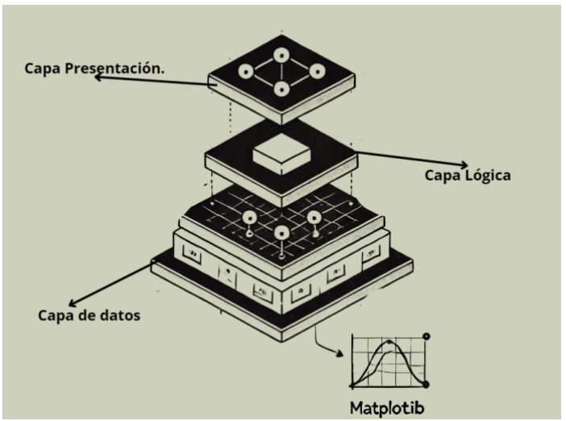

# Simulador Educativo de Física

## Índice

- **RESUMEN.**
- **ESPECIFICACIÓN DE REQUISITOS DEL SOFTWARE.**
  - Introducción.
  - Descripción general.
  - Requisitos específicos.
  - Casos de uso.
  - Restricciones.
- **DISEÑO DE ARQUITECTURA DEL SOFTWARE.**
  - Introducción.
  - Diagrama de arquitectura.
  - Descripción de componentes y sus interfaces.
  - Patrones de diseño y vista gráfica.
  - Resultados de diseño.
- **DISEÑO DETALLADO DEL SOFTWARE.**
  - Diseño arquitectónico.
  - Descripción de la descomposición.
  - Fundamento del diseño.
  - Descripción general de la interfaz de usuario.
  - Matriz de requisitos.
  - Diagrama de clases.
  - Estructura de datos.
  - Interfaces de los componentes.
- **MANUAL DE USUARIO.**
  - Guía de instalación.
  - Guía de uso.
  - Preguntas frecuentes.
  - Solución de problemas comunes.
- **MANUAL DE MANTENIMIENTO.**
  - Procedimientos de mantenimiento.
  - Plan de actualizaciones.
  - Manejo de errores.
  - Copias de seguridad y recuperación.
  - Consideraciones especiales.
- **PLAN DE GESTIÓN DE CONFIGURACIÓN.**
  - Gestión de configuración del software.
- **PLAN DE GESTIÓN DEL PROYECTO.**
  - Introducción.
  - Planificación del cronograma.
  - Gestión de riesgo.
  - Gestión de calidad.
- **DOCUMENTACIÓN DE PRUEBAS.**
  - Propósito.
  - Alcance.
  - Estrategia de pruebas.
  - Estrategia de ejecución.
  - Requisitos ambientales.
- **GUÍA DE IMPLEMENTACIÓN.**
  - Requisitos del sistema.
  - Descarga y configuración.
  - Ejecución del simulador.
  - Interacción con el simulador.
  - Problemas comunes y soluciones.
- **DOCUMENTACIÓN DE LA API.**
- **REFERENCIAS.**

## Resumen

Este proyecto presenta el desarrollo de un simulador educativo enfocado en la enseñanza de conceptos fundamentales de Física, específicamente en las temáticas de cuerpos en equilibrio y tiro parabólico, dirigido a estudiantes y docentes en general. 

La iniciativa surge ante las dificultades que enfrentan los alumnos para comprender estos temas debido a la falta de herramientas interactivas y la limitada conectividad a internet en algunos entornos. Este simulador, que no requiere conexión a internet, busca facilitar un aprendizaje práctico y dinámico, permitiendo a los estudiantes explorar y entender conceptos a su propio ritmo.

El sistema tiene como objetivo principal proporcionar una herramienta interactiva que apoye a los estudiantes y docentes en la comprensión del tema 1: primera condición de equilibrio en Física, tema 2: tiro parabólico, mediante simulaciones que representen de manera visual y práctica los principios físicos involucrados.

## Especificación de Requisitos del Software

### Introducción

#### Propósito

El propósito de este documento es especificar los requisitos del para un simulador educativo diseñado para ayudar a los estudiantes de bachillerato a comprender la primera condición de equilibrio en Física 1. Este simulador será una herramienta interactiva que permitirá a los usuarios explorar conceptos de manera práctica y dinámica, así como comprobar resultados de ejercicios sobre este tema.

#### Convenciones del documento

Este documento sigue normas tipográficas especificas para garantizar claridad y consistencia, lo que facilita la lectura en pantallas. Los títulos y subtítulos están destacados por puntos, lo que permite una rápida identificación de las secciones. Además, se establece que las prioridades de los requisitos, cada enunciado tiene su propia prioridad claramente indicada.

#### Público al que va dirigido y sugerencias de lectura

El documento está destinado a varios tipos de lectores:
* Desarrolladores: Necesitan entender los requisitos funcionales y no funcionales del simulador.
* Usuarios finales (estudiantes): Interesados en cómo el simulador puede faciliar su aprendizaje.
* Evaluadores: Encargados de valorar la usabilidad y efectividad del simulador.
La organización del SRS se estructura en varias secciones clave, comenzando con una introducción general, seguida por la descripción del producto, donde se detallan las funciones y características. Se sugiere leer primero la sección de introducción, luego la descripción general, y finalmente las secciones específicas según el interés.

#### Ámbito del Sistema

Este simulador tiene como objetivo principal proporcionar una herramienta interactiva que permita a los estudiantes y docentes en general explorar y comprender los temas de la primera condición de equilibrio y el tiro parabólico en la materia de Física 1.

Funcionalidades del Sistema:
* Simulación Interactiva: Permitirá a los usuarios manipular objetos físicos virtuales para observar dichas simulaciones.
* Visualización de Resultados: Ofrecerá gráficos y retroalimentación inmediata sobre el estado del sistema simulado.
* Accesibilidad Offline: No requerirá conexión a internet, facilitando su uso en cualquier momento y lugar.

Por otro lado, el sistema no incluirá:
Contenido Avanzado: No abordará temas más allá de la primera condición de equilibrio.
Interacción en Tiempo Real con Otros Usuarios: No permitirá la colaboración en tiempo real entre múltiples usuarios.

#### Beneficios, Objetivos y Metas.

Los beneficios esperados del Simulador incluyen:
* Mejora en la Comprensión Conceptual: Al permitir a los estudiantes interactuar con el contenido, se espera que logren enriquecer sus conocimientos al llevar la teoría a la practica de manera virtual.
* Fomento del Aprendizaje Autónomo: Los estudiantes podrán explorar a su propio ritmo, lo que es especialmente útil para aquellos que requieren más tiempo para entender los temas.
Los objetivos específicos del sistema son:
* Identificar las características esenciales de un simulador a partir de la revisión de literatura y sitios académicos reconocidos.
* Determinar las características del simulador de acuerdo con las necesidades.
* Diseñar e implementar un simulador de escritorio.
Las metas incluyen:
* Evaluar la efectividad del simulador mediante encuestas de satisfacción y usabilidad al finalizar su uso en el aula.

#### Definiciones, Acrónimos y Abreviaturas

Simulador Educativo. Un simulador educativo es una herramienta digital diseñada para replicar virtualmente un fenómeno o proceso específico. Su principal objetivo es ofrecer la oportunidad de explorar, comprender y experimentar conceptos de forma interactiva y atractiva, fomentando la comprensión a través de la práctica [1].

CSUQ. (Cuestionario de usabilidad del sistema) es un cuestionario estandarizado de 15 ítems que se utiliza para medir la satisfacción percibida por los usuarios y la usabiliad de un sistema, sitio web, software o producto al final de un estudio o prueba de usabiliad [18].

### Descripción General

#### Perspectiva del Producto

El Simulador es una herramienta independiente que se integra en el ámbito educativo, específicamente en la enseñanza de la física. Este producto se relaciona con otras herramientas educativas digitales, pero no depende de ellas para su funcionamiento. A diferencia de otros simuladores que requieren conexión a internet o son parte de plataformas más amplias, este simulador está diseñado para operar de manera autónoma en computadoras personales.

#### Funciones del Producto

El Simulador incluirá varias funciones clave:
* Simulación Interactiva: Permite a los usuarios manipular objetos virtuales para observar los efectos de diferentes objetos simulados.
* Visualización Gráfica: Proporciona gráficos que ilustran las fuerzas actuantes y el estado del sistema simulado y trayectoria con el rastro en el lanzamiento del proyectil.
* Retroalimentación Inmediata: Ofrece resultados instantáneos sobre las decisiones del usuario, ayudando a identificar errores por parte de los estudiantes y mejorar la comprensión.
* Configuración Personalizada: Los usuarios podrán ajustar parámetros como peso, ángulo para explorar diferentes escenarios y velocidad de lanzamiento.

#### Características de los Usuarios

Los usuarios del Simulador de Equilibrio y Tiro Parabólico son principalmente estudiantes y docentes. Se espera que tengan conocimientos previos sobre temas fundamentales como fuerzas, vectores y movimiento en caso de los estudiantes, así como un primer acercamiento al estudio del tiro parabólico. Además, deben contar con habilidades tecnológicas suficientes para interactuar con software educativo, aunque no se requiere experiencia previa en el uso de simuladores.

#### Clases de Usuario y Características

Se identificaron dos clases de usuarios que interactuarán con el Simulador de Equilibrio y Tiro Parabólico:
* Estudiantes.
* Docentes.
Entre las características relevantes de los usuarios se destacan la frecuencia de uso, que se estima diaria durante las sesiones de clase; el nivel educativo, correspondiente al bachillerato; y la experiencia técnica, que suele ser básica, aunque suficiente para manejar recursos digitales educativos de forma autónoma.

#### Entorno operativo

El software operará en un entorno específico que incluye:
* Plataforma de hardware: Computadoras personales estándar sin requerimientos especiales.
* Sistema operativo: Compatible con Windows.
* Componentes adicionales: El simulador debe coexistir con bibliotecas como Pygame y Matplotlib, utilizadas para gráficos y
* visualizaciones, esto ya esta previamente incluido dentro del simulador.
Este entorno garantiza que el software sea accesible para todos los estudiantes sin necesidad de hardware avanzado.

#### Suposiciones y Dependencias

El desarrollo del Simulador de Equilibrio y Tiro Parabólico se basa en varias suposiciones clave:
* Se asume que todos los estudiantes y docentes tendrán acceso a computadoras personales o dispositivos compatibles con el software del simulador, ya sea en casa o en el entorno escolar.
* Se considera que los estudiantes cuentan con conocimientos básicos de física, incluyendo nociones fundamentales sobre fuerzas,
* vectores, movimiento rectilíneo y una introducción al tiro parabólico, antes de utilizar el simulador.
* La implementación efectiva del simulador dependerá de la disponibilidad continua del personal docente, quien desempeñará un papel fundamental en la orientación y acompañamiento de los estudiantes, especialmente durante las primeras sesiones de uso.
* Además, se asume que el entorno escolar apoyará el uso de recursos digitales como parte del proceso educativo.
Cualquier cambio significativo en estas condiciones como la falta de acceso tecnológico, limitaciones en la formación previa de los estudiantes o la ausencia de acompañamiento docente podría requerir una revisión y ajuste de los requisitos establecidos para el correcto funcionamiento y aprovechamiento del simulador.

#### Documentación del usuario

La documentación del usuario incluirá componentes esenciales:
* Manual del usuario: Instrucciones detalladas sobre cómo utilizar el simulador.

#### Descripción y prioridad

Cada característica del simulador se describe brevemente junto a su prioridad:
* Simulación Interactiva: Permite manipular objetos virtuales. Prioridad alta.
* Visualización Gráfica: Muestra gráficos sobre fuerzas actuantes. Prioridad media.
* Retroalimentación Inmediata: Proporciona resultados instantáneos. Prioridad alta.

#### Interfaces de usuario

Las interfaces entre el producto y los usuarios incluyen:
* Diseño intuitivo: La interfaz es fácil de usar, con botones claramente etiquetados.
* Menú: Menú de opciones para tanto para la interfaz inicial y la del simulador.

#### Interfaces de software

Las conexiones entre este producto y otros componentes incluyen:
* Bases de datos: El simulador no requiere bases de datos externas ni locales, pero debe ser capaz de mostrar resultados.
* Herramientas integradas: Se utilizan bibliotecas comp Pygame, Matplotlib y Canvas.

### Requisitos Específicos

#### Requisitos funcionales

Simulación Interactiva:
* El sistema permitirá a los usuarios manipular objetos virtuales.
Visualización de Resultados:
* El simulador mostrará gráficos, incluyendo vectores de fuerza y tensiones, trayectoria del lanzamiento.
Retroalimentación Inmediata:
* Proporcionará resultados instantáneos, ayudando a identificar errores al simulador proporcionar resultados inmediados.
Configuración Personalizada:
* Los usuarios podrán ajustar parámetros, permitiendo la exploración de diferentes escenarios.
Interfaz Intuitiva:
* La interfaz gráfica será fácil de usar, facilitando la navegación.

#### Requisitos no funcionales

Usabilidad:
* El simulador debe ser intuitivo y fácil de usar, permitiendo a los estudiantes interactuar con él sin necesidad de formación previa.
Rendimiento:
* El sistema debe responder a las interacciones del usuario en menos de un segundo para asegurar una experiencia fluida.
Compatibilidad:
* Debe funcionar en computadoras personales estándar sin requerir hardware especializado.
Accesibilidad Offline:
* El simulador debe ser completamente funcional sin necesidad de conexión a internet.
Mantenibilidad:
* El código del simulador debe estar bien documentado y estructurado para facilitar futuras actualizaciones y mantenimiento.
Escalabilidad:
* El diseño del simulador debe permitir la incorporación futura de nuevos temas o funcionalidades sin requerir una reestructuración completa del sistema.

### Casos de uso - cuerpos en equilibrio

* Caso 1

* Caso 2

* Caso 3

* Caso 4

* Caso 5

### Casos de uso - Tiro parabólico

* Caso 1

* Caso 2

* Caso 3

* Caso 4

* Caso 5

### Restricciones

Limitaciones de Hardware: El sistema debe ser compatible con computadoras estándar disponibles de los alumnos, lo que implica que no puede requerir hardware especializado o de alto rendimiento.

Acceso Offline: El simulador debe funcionar completamente sin conexión a internet.

Lenguaje de Programación: El desarrollo del simulador se llevará a cabo utilizando Python y bibliotecas específicas como Pygame y Matplotlib.

Interfaz de Usuario: La interfaz debe ser accesible y fácil de usar para estudiantes con diferentes niveles de habilidad técnica, lo que puede limitar la complejidad de las interacciones y visualizaciones.

Requisitos de Habilidad: Se asume que los usuarios tienen un nivel básico de conocimientos en fisica y habilidades tecnológicas suficientes para interactuar con el simulador, lo que puede restringir su uso a estudiantes que no cumplan con estos criterios.

Consideraciones de Seguridad: Aunque el simulador no manejará datos sensibles, se deben implementar medidas básicas para proteger la privacidad del usuario durante su uso.

Criticalidad de la Aplicación: La aplicación no debe fallar durante su uso en el aula, ya que esto podria interrumpir el proceso educativo. Por lo tanto, se requiere un alto nivel de fiabilidad en su funcionamiento.

## Diseño de arquitectura del Software

### Introduccion

#### Propósito

Este documento tiene como objetivo proporcionar una descripción de la arquitectura del Simulador, una herramienta educativa diseñada para ayudar a los estudiantes y docentes. A través de diversas vistas arquitectónicas, se busca capturar y comunicar las decisiones arquitectónicas clave que guiarán el desarrollo del sistema, asegurando que cumpla con los requisitos educativos establecidos.

#### Ámbito de aplicación

El Simulador es una herramienta independiente que permite a los estudiantes explorar concepto sin necesidad de conexión a Internet. Teniendo así una herramienta que pueden tener a la mano, y ayudarse con problemas de seguridad por parte de los estudiantes y proporcionar una experiencia de aprendizaje interactiva y accesible.

#### Definiciones, acrónimos y abreviaturas

Para facilitar la comprensión del documento y asegurar que todos los lectores tengan una interpretación clara de los términos utilizados, se presenta a continuación un glosario:

* Simulador educativo: Herramienta digital diseñada para replicar virtualmente un fenómeno o proceso específico, permitiendo a los estudiantes explorar y comprender conceptos de forma interactiva y atractiva.
* Python: Lenguaje de programación de alto nivel, interpretado y versátil, conocido por su sintaxis clara y legible. Se utiliza en desarrollo web, análisis de datos, inteligencia artificial y otras áreas.
* Pygame: Biblioteca de Python utilizada para crear videojuegos y simulaciones, que proporciona funcionalidades para gráficos, sonido y manejo de eventos.
* Matplotlib: Biblioteca de Python que permite crear gráficos en 2D, facilitando la visualización de datos en un entorno cartesiano.
* Tkinter Canvas: Herramienta en Python que permite crear gráficos vectoriales 2D y superponer ventanas, útil para la construcción de interfaces gráficas interactivas.
* Diagrama de cuerpo libre: Representación gráfica que muestra todas las fuerzas que actúan sobre un cuerpo en equilibrio, facilitando el análisis de las condiciones necesarias para mantener el equilibrio.
* Primera condición de equilibrio: Principio físico que establece que la suma vectorial de todas las fuerzas actuando sobre un cuerpo es igual a cero, lo que implica que no hay movimiento neto en ninguna dirección.
* Interfaz gráfica: Elemento visual del simulador que permite al usuario interactuar con el sistema, ajustando parámetros y visualizando resultados.
* Usabilidad: Medida de cuán fácil y eficiente es utilizar un sistema o herramienta, incluyendo aspectos como la satisfacción del usuario y la facilidad de aprendizaje.
* CSUQ (Post-Study System Usability Questionnaire): Cuestionario utilizado para evaluar la usabilidad de sistemas después de su uso, centrado en la calidad del sistema y la interfaz.
* Tiro parabólico: Movimiento de un objeto lanzado con una velocidad inicial en un ángulo respecto a la horizontal, bajo la influencia de la gravedad, describiendo una trayectoria parabólica en un plano bidimensional.

### Diagrama de arquitectura

El diagrama de arquitectura del Simulador ilustra la estructura general del sistema y cómo interactúan sus componentes. El sistema se divide en tres capas principales:

Cuerpos en equilibrio.

Tiro parabólico.

### Descripción de componentes y sus interfaces

#### Representación arquitectónica

La arquitectura del Simulador se presenta a través de varias vistas: vista de caso de uso, vista lógica, vista de proceso y vista de implementación. Cada vista ofrece una perspectiva única sobre diferentes aspectos del sistema, permitiendo una comprensión más profunda de su estructura y funcionamiento.

#### Objetivos y limitaciones arquitectónicas

La arquitectura del sistema está influenciada por varios requisitos y limitaciones clave:
* Integración con sistemas existentes: El simulador debe acceder a datos relevantes.
* Accesibilidad remota: Todas las funciones deben ser accesibles desde computadoras personales sin necesidad de conexión a Internet.
* Seguridad: Aunque no maneja datos sensibles, se implementarán medidas básicas para proteger la privacidad del usuario.
* Rendimiento: El sistema debe responder a las interacciones del usuario en menos de un segundo para asegurar una experiencia fluida.

#### Interfaz Gráfica

Descripción
* Proporciona la interacción del usuario con el simulador.
Interfaces
* Métodos para iniciar la simulación automática al ajustar parámetros.
* Métodos para mostrar resultados y gráficos generados.
 
#### Módulo de Cálculo

Descripción
* Contiene la lógica para calcular las tensiones y posiciones.
Interfaces
* Métodos que reciben parámetros desde la interfaz gráfica y devuelven resultados calculados.

#### Módulo Gráfico

Descripción
* Genera visualizaciones gráficas basadas en los cálculos realizados.
Interfaces
* Métodos que crean gráficos y devuelven la posición de las imágenes que se muestran en la interfaz gráfica.

### Patrones de diseño vista lógica

El patrón MVC se aplica para separar la lógica del negocio, la presentación y el control de la aplicación. Esto permite una mayor modularidad y facilita el mantenimiento. Para este simulador se aplicó el mismo patrón de diseño:
Modelo:
* En este caso, el modelo incluye las funciones que realizan cálculos físicos, como "Solution", calculateTensions, calculateBodyPosition". Estas funciones manejan la lógica del simulador y no están directamente relacionadas con la interfaz gráfica.
Vista:
* La vista está representada por las funciones que dibujan en la pantalla, como "drawScene, crearGrafico". Estas funciones son responsables de mostrar los resultados al usuario.
Controlador:
* Actúa como controlador. Maneja los eventos del usuario (clics del mouse, movimiento) y actualiza el modelo y la vista en consecuencia.

### Resultados

La implementación del Simulador ha permitido obtener un producto funcional que cumple con las características deseadas:
* Simulación interactiva: Los estudiantes pueden manipular parámetros como peso y ángulos en tiempo real.
* Visualización gráfica en tiempo real: Los resultados se presentan inmediatamente después de cualquier ajuste realizado por el usuario.
* Diseño intuitivo: La interfaz es fácil de usar, permitiendo que incluso aquellos sin experiencia técnica puedan operar el simulador eficientemente.

## Manual de usuario

### Guía de Instalación

Requisitos Previos:
* No se requieren instalaciones adicionales, ya que el simulador está empaquetado como un archivo portable.
Descarga del Simulador:
* Descarga el archivo del simulador desde la fuente proporcionada por tu instructor or desde el sitio web oficial.
* Official website of Sitio: https://carlosher6506.github.io/SitePerson/

Ejecutar el Simulador:
* Guarda el archivo en una ubicación accesible, como tu escritorio.
* Puede hacer doble clic en el archivo para iniciar la simulación. No es necesario realizar la instalación.

### Guía de Uso

Para ejecutar el simulador el usuario debe dar doble clic al icono.

### Preguntas Frecuentes 

¿Qué hago si no puedo iniciar el simulador?
* Asegurate de haber descargado correctamente el archivo y con todos sus components.

¿Puedo usar el simulador sin conexión a internet?
* Si, el simulador está diseado para funcionar completamente offline y no requiere conexión a internet.

¿Cómo puedo ajustar los parámetros durante la simulación?
* El simulador tiene la funcionalidad de modificar estos parametros al mismo tiempo.

¿Qué debo hacer si encuentro un error en la simulación?
* Anota cualquier error y contactar al creador o visita la documentación para posibles soluciones.

### Solución de Problemas Comunes

El simulador no se abre:
* Verifica que has descargado correctamente el archivo, así como sus componentes y que tienes permisos para ejecutarlo.
* Verifica si descargaste la versión para tu sistema operativo.

La simulación se congela o no responde:
* Intenta reiniciar el simulador cerrando la ventana y vuelve a abrirlo.
* Asegúrate de que tu computadora cumpla con los requisitos mínimos de hardware.

Los gráficos no se generan correctamente:
* Verifica si hay actualizaciones disponibles para tu sistema operativo que puedan afectar la ejecución del software.

Problemas de visualización:
* Si las imágenes no se cargan correctamente, asegurate de que todas las imágenes necesarias estén incluidas en la misma carpeta donde se encuentra el archivo.

## Manual de mantenimiento

### Procedimientos de Mantenimiento

#### Revisión Periódica del Software

* Realizar revisiones mensuales para asegurarse de que el simulador funcione correctamente.
* Verificar que todas las imágenes y recursos gráficos están presentes y accesibles en las rutas especificadas.

#### Actualización de Bibliotecas

* Mantener actualizadas las bibliotecas de Python necesarias para el funcionamiento del simulador. Utilizar los siguientes comandos en la terminal:
* pip install -upgrade pygame matplotlib canvas math

#### Monitoreo de Errores

* Registrar cualquier error o fallo que ocurra durante el uso del simulador.
* Revisar los registros de errores para identificar patrones o problemas recurrentes.

#### Pruebas de Funcionalidad

* Después de realizar actualizaciones, ejecutar pruebas para verificar que todas las funciones del simulador operen como se espera.
* Incluir pruebas específicas para cada funcionalidad principal, como la simulación, visualización de gráficos y ajustes de parámetros.

### Plan de Actualizaciones

#### Frecuencia de Actualizaciones

* Realizar actualizaciones mayores cada seis meses, o según sea necesario si se identifican errores críticos.
* Implementar actualizaciones menores cuando se realicen mejoras o correcciones.

#### Registro de Cambios

* Mantener un registro detallado de las actualizaciones realizadas, incluyendo fechas, descripciones de cambios y responsables.
* Documentar cualquier nueva funcionalidad añadida o mejoras en la interfaz.

#### Pruebas Post-Actualización

* Después de cada actualización, llevar a cabo pruebas para asegurar que el simulador funcione correctamente y que no haya introducido nuevos errores.

### Manejo de Errores

#### Identificación de Errores

* Monitorear el rendimiento del simulador y registrar cualquier error que ocurra durante su uso.
* Utilizar mensajes de error claros que ayuden a identificar la causa del problema.

Solución de Problemas Comunes
* Consultar la sección "Solución de Problemas Comunes." el manual del usuario para abordar problemas frecuentes.
* Si un problema persiste, consultar la documentación técnica o buscar asistencia en foros especializados.

Restauración a Versiones Anteriores
* Mantener copias de seguridad del software antes de realizar actualizaciones importantes.
* En caso de un error crítico tras una actualización, restaurar la versión anterior utilizando las copias de seguridad.
* Usar Git como controlador de versiones.

### Copias de Seguridad y Recuperación

Frecuencia de Copias de Seguridad
* Realizar copias de seguridad completas del simulador y sus recursos al menos una vez al mes.
* Asegurarse de incluir todos los archivos relevantes, incluidos gráficos, configuraciones y scripts.

Método de Copia
* Utilizar GitHub como herramientas automatizada para controlar las copias de seguridad regulares.
* Verificar periódicamente que las copias sean accesibles y estén completas.
* Usa el proceso abitual para subir tus cambios remotos a la nube de git (add, commit, pull, push).

### Consideraciones Especiales

Manejo de Recursos Gráficos
* Asegurarse de que todas las imágenes (como Giro.png, Peso.png, etc.) estén disponibles en las rutas especificadas dentro del código. Si se cambian las ubicaciones, actualizar el código correspondiente.

Configuraciones Iniciales
* Verificar que las configuraciones iniciales (como dimensiones y colores) sean adecuadas y se mantengan consistentes con el diseño original del simulador.

Funciones Matemáticas
* Revisar periódicamente las funciones matemáticas para garantizar que los cálculos sean precisos y eficientes.

Gestión del Ciclo Principal
* Asegurarse de que el ciclo principal funcione correctamente sin bloqueos ni errores inesperados durante la ejecución.
* Monitorear eventos como clics del mouse y movimientos para garantizar que se manejen adecuadamente sin causar fallos en el programa.

Gestión Visual y Gráfica
* Comprobar que todas las funciones gráficas generen visualizaciones correctas sin errores visuales ni problemas en la representación gráfica.

## Plan de gestión de configuración

### Gestión de Configuración del Software.

#### Control de Versiones

El control de versiones es esencial para mantener un registro claro y accesible de las diferentes iteraciones del simulador. Se utilizará un sistema de control de versiones (Git hub), para gestionar el código fuente y los documentos asociados. Las versiones se numerarán utilizando un esquema semántico que incluirá:
* Versión Principal (1.0.0): Cambios significativos que pueden incluir nuevas funcionalidades o cambios drásticos en la interfaz.
* Versión Secundaria (0.1.0): Mejoras menores y correcciones de errores que no afectan la funcionalidad principal.
* Versiones de Parche (0.0.1): Correcciones rápidas para errores críticos.
Cada vez que se realice un cambio en el código, se documentará en un registro de cambios, especificando qué se modificó, por qué y quién lo realizó. Este registro será accesible a todos los miembros del equipo para garantizar la transparencia en el proceso.

#### Control de Cambios

Los cambios en los elementos de configuración se gestionarán a través de un proceso formalizado. Cualquier modificación propuesta deberá ser documentada en una Solicitud de Cambio (CCR) que incluirá:
* Descripción del cambio propuesto.
* Justificación del cambio.
* Impacto esperado en el sistema.
* Evaluación del tiempo y recursos necesarios.
Los cambios serán implementados y registrados, asegurando que todo este documento y al dia de las modificaciones realizadas.

#### Gestión de Entornos.

El simulador será desarrollado y probado en entornos para asegurar su funcionalidad. Los entornos incluirán:
* Entorno de Desarrollo: Donde los desarrolladores implementan nuevas características y realizan pruebas iniciales.
* Entorno de Pruebas: Utilizado para realizar pruebas, incluyendo pruebas unitarias e integradas, asegurando que todas las funcionalidades operen como se espera.
* Entorno de Producción: La versión final del simulador que será utilizada por los estudiantes y profesores.
Cada entorno tendrá configuraciones específicas y será administrado para garantizar que las versiones del software sean consistentes y estèn alineadas con las especificaciones definidas.

#### Procedimientos Adicionales

Formación del Personal
* Se proporcionará formación regular al equipo sobre las mejores prácticas en gestión de configuración, incluyendo el uso del sistema de control de versiones y la documentación adecuada para cambios en el software.
Documentación
* Toda la documentación relacionada con la configuración, incluyendo registros de cambios, informes de auditoría y manuales operativos, se almacenará en un repositorio centralizado y accesible.

## Referencias

1. Beer, F.P, Johnston, E.R. (2017). *Vector Mechanics for Engineers: Statics*. McGraw-Hill Education.
2. Zacharia, Z. C., & Olympiou, G. (2011). Physical versus virtual manipulative experimentation in physics learning. *Learning and Instruction*, 21(3), 317-331. [https://doi.org/10.1016/j.learninstruc.2010.03.001](https://doi.org/10.1016/j.learninstruc.2010.03.001)
3. Rooney, D. (2022). The impact of simulation-based education on health professionals: A meta-analysis. *Medical Education and Practice*. [https://pmc.ncbi.nlm.nih.gov/articles/PMC11224887/](https://pmc.ncbi.nlm.nih.gov/articles/PMC11224887/)
4. Thompson, L, Cooper, A. (2022). Enhancing remote learning through educational simulations in STEM. *International Journal of E-Learning and Distance Education*.
5. Abosede, A, Ramnarain, U. (2022). Teaching and learning physics using interactive simulation: A guided inquiry practice. [https://scielo.org.za/scielo.php?script=sci_arttext&pid=S0256-0100202000100003](https://scielo.org.za/scielo.php?script=sci_arttext&pid=S0256-0100202000100003)
6. Chanchí Golondrino, G. E, Gómez Álvarez, M. C, & Sierra Martínez, L. M. (2022). Directrices para el diseño y la construcción de videojuegos educativos. [https://revistas.upn.edu.co/index.php/RCE/article/view/12759](https://revistas.upn.edu.co/index.php/RCE/article/view/12759)
7. Gallegos Zurita, D. E, & Pavón, C. (2017). Diseño de un simulador educativo en MATLAB como soporte a la enseñanza de espejos cóncavos. [https://www.iiis.org/CDs2017/CD2017Summer/papers/CA373QX.pdf](https://www.iiis.org/CDs2017/CD2017Summer/papers/CA373QX.pdf)
8. PhET. (2024). Simulaciones interactivas PhET: Características de diseño. [https://phet.colorado.edu/es/inclusive-design](https://phet.colorado.edu/es/inclusive-design)
9. Educaplus. (2022). Simuladores y juegos de Física. [https://www.educaplus.org/games/fisica](https://www.educaplus.org/games/fisica)
10. Universidad Nacional Autónoma de México. (2013). Objetos de aprendizaje UNAM. [http://www.objetos.unam.mx/](http://www.objetos.unam.mx/)
11. Hedlefs Aguilar, M. I, de la Garza González, A, Sánchez Miranda, M. P, & Garza Villegas, A. A. (2017). Adaptación al español del Cuestionario de Usabilidad de Sistemas Informáticos (CSUQ).